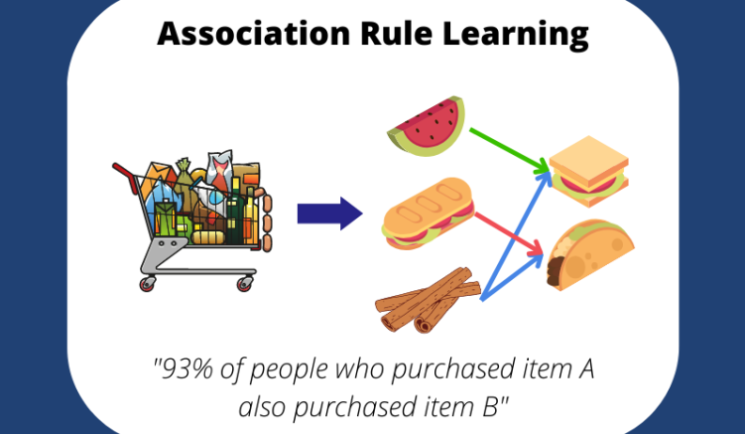
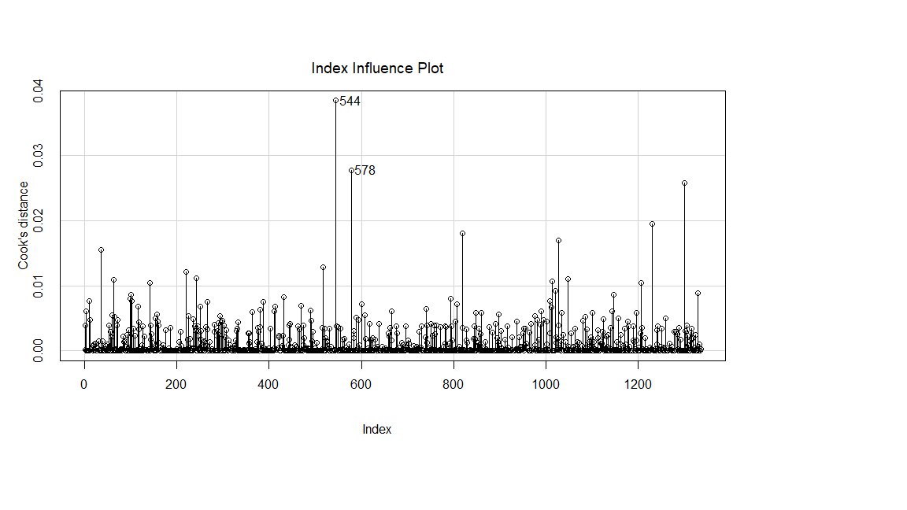
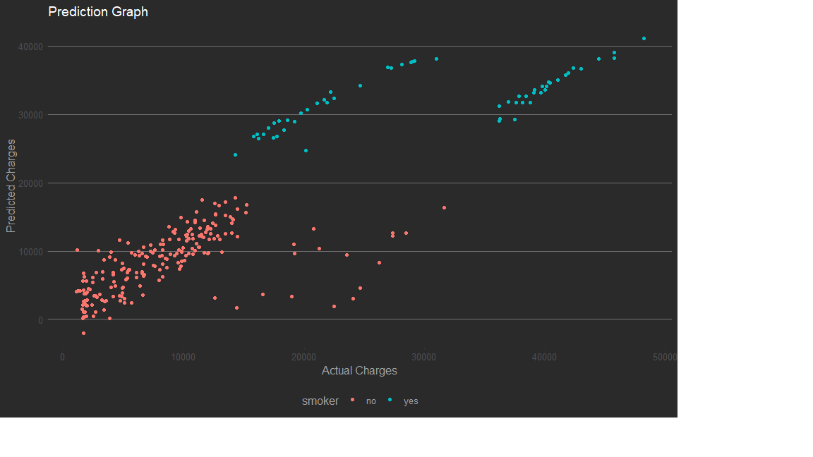
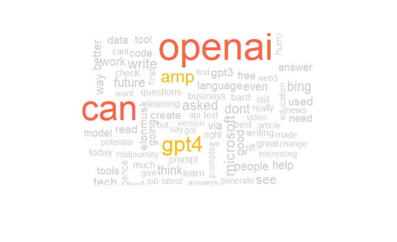

<script type="text/javascript" src="https://platform.linkedin.com/badges/js/profile.js" async defer></script>
<style>
  .col2 {
    columns: 2 300px;         /* number of columns and width in pixels*/
    -webkit-columns: 2 200px; /* chrome, safari */
    -moz-columns: 2 200px;    /* firefox */
  }
</style>
 
<div class="col2">

### **Hello World!**

I am Lucy, a Data analyst leveraging data insights to enhance company operations, optimize processes, and drive efficient decision-making for continuous improvement.
I have a graduate degree in Data Analytics and I enjoy solving complex
business problems using data. I love jogging and cannot sleep
without watching Youtube.


<br>
<br>


<br>
<div class="col2">
<center>
<a href=" https://www.linkedin.com/in/wu-lucy/"></a>
<a href="https://github.com/Lucywuinwa"></a>
<a href="mailto:lucywuinwa@gmail.com"></a>
</center>
</div>


</div>


---
```{r setup, include=FALSE}
knitr::opts_chunk$set(message=FALSE,warning=FALSE, cache=FALSE)
```
                                                                                                                
This is a repository of some of the projects I worked on. 


## Unsupervised learning

Data Science and Analytics is nowadays widely used in retail industry. With the advent of bid data tools and higher computing power, sophisticated algorithms can crunch huge volumes of transaction data to extract meaningful insights. Companies such as Kroger invest heavily to transform more than a hundred-year-old retail industry through analytics.

This project is an attempt to apply unsupervised learning algorithms on the transaction data to formulate strategies to improve the sales of the products.


<br>
**Following steps are discussed:**


* **Customer Segmentation**
* **Deciding optimum number of clusters**
* **Market Basket Analysis**

<a href="retail.html">
![contnue reading..]
</a>
<br>

## Regression Diagnostics

The purpose of this project is to solve a problem using linear regression and understand various feature selection and model selection techniques. In this project we predict the insurance charges based on different details.

<div class="col2">




</div>
<br>

**Following major steps are discussed :**

* **Exploratory Data Analysis**
* **Model building**
* **Regression model diagnostics **

<a href="insurencecharges.html">
![contnue reading..]
</a>
<br>


## Sentiment Analysis of ChatGPT

ChatGPT is a powerful LLM created by Open AI which has been a recently gained a lot of popularity due to its ability to perform a wide variety of tasks well and gained a lot of attention on social media platforms where people have been discussing about it.Let’s explore what Twitterati think about this phenomenon.


<br>

**Following major steps are discussed :**

* **Data Cleaning**
* **Sentiment Analysis**
* **Twitter impression analysis of top users**

<a href="Twitter2023.html">
![contnue reading..]
</a>
